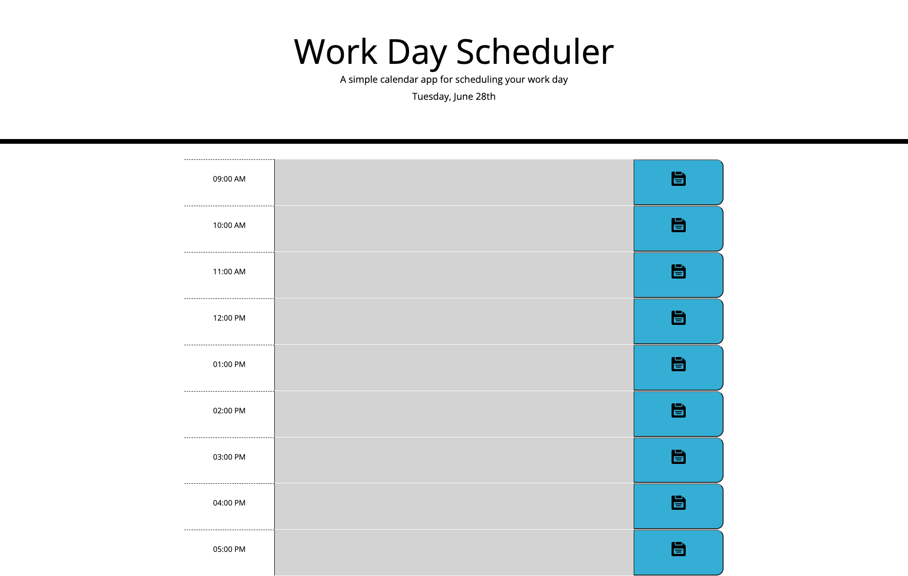

# Daily Planner

## This is a website created to plan hourly events.
## Events can be stored in local storage for later use.
## Each hour has its own data entry, as well as its own button to save the event.
## Also in the top of the page, the current date is displayed for a more accurate planning.
## Finally the input box displays different colors (green, salmon or gray) depending on what time of day the website is being used.

### [Daily Planner Link](https://pargasparedes.github.io/DailyPlanner/)

### 
